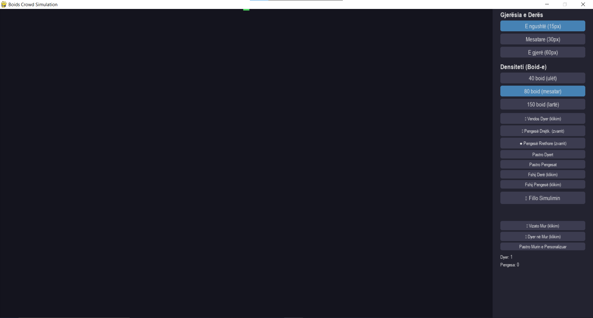
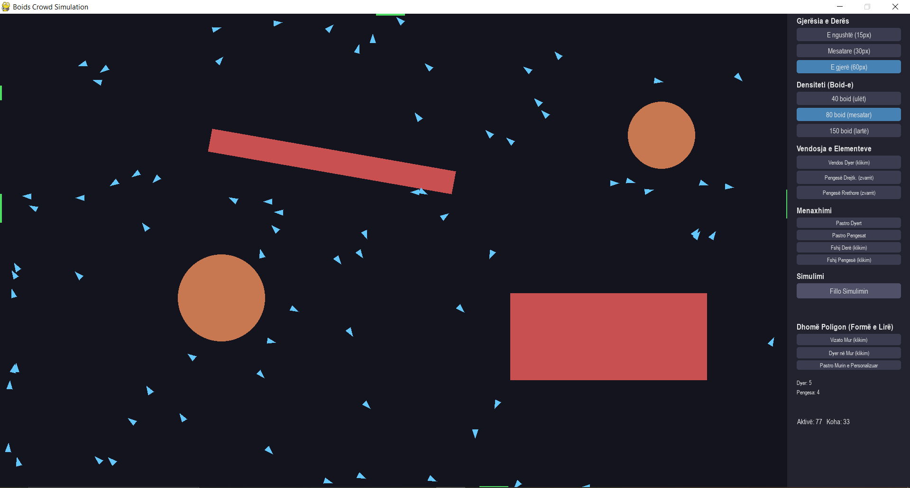
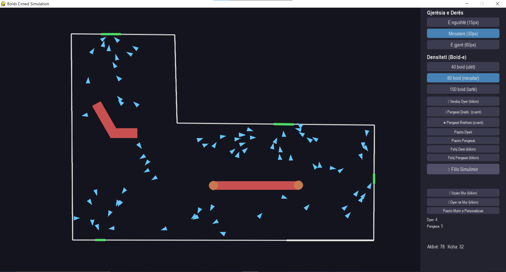
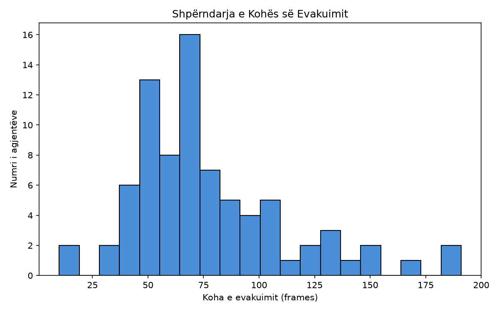

# Boids Crowd Evacuation

Simulim i evakuimit të turmave bazuar në modelin **Boids** (Craig Reynolds, 1986) i kombinuar me **pathfinding Dijkstra multi-burim (flow field)**, i ndërtuar në Python me `pygame`. Projekti është zhvilluar si temë diplome, me fokus te modelimi i sjelljes së turmës drejt daljeve të emergjencës, në hapësira me forma dhe pengesa të ndryshme.

## Përmbajtja

- [Përshkrimi](#përshkrimi)
- [Pamje nga aplikacioni](#pamje-nga-aplikacioni)
- [Veçoritë](#veçoritë)
- [Instalimi](#instalimi)
- [Përdorimi](#përdorimi)
- [Struktura e projektit](#struktura-e-projektit)
- [Arkitektura](#arkitektura)
- [Eksperimentet dhe testimi statistikor](#eksperimentet-dhe-testimi-statistikor)
- [Teknologjitë](#teknologjitë)
- [Kontekst akademik](#kontekst-akademik)

## Përshkrimi

Aplikacioni simulon lëvizjen e një turme (agjentë/"boids") drejt daljeve të një hapësire, duke kombinuar:

- **Rregullat klasike të Boids**: *separation* (largim nga fqinjët e afërt), *alignment* (përafrim me drejtimin e fqinjëve), *cohesion* (tërheqje drejt qendrës lokale të grupit).
- **Pathfinding me Dijkstra multi-burim** (flow field): çdo qelizë e hapësirës ka një drejtim të para-llogaritur drejt daljes më të afërt, duke shmangur pengesat, me kosto shtesë (jo bllokim absolut) pranë mureve, që prodhon rrugë natyrshëm larg qosheve kur është e mundur.
- **Grid hapësinor (spatial grid)** për kërkim O(n) të fqinjëve, në vend të O(n²) — kritik për densitete të larta boid-esh pa rënie të performancës.
- **Forcë dinamike kohezioni**: e ulët në hapësirë të hapur, e lartë pranë pengesave — parandalon "shpërndarjen" e panatyrshme të grupit larg njëri-tjetrit teksa manovron rreth pengesave.
- **Zbulim dhe zgjidhje "ngërçi"**: agjentët që mbeten të bllokuar (pa progres real drejt daljes për N frame) marrin një impuls korrigjues, jo zëvendësim total të shpejtësisë.

## Pamje nga aplikacioni

**Ekrani fillestar** (dhomë standarde, dera e vetme default lart, paneli i kontrollit):



**Simulim aktiv** (dhomë standarde me 5 dyer dhe 4 pengesa — drejtkëndëshe, e rrotulluar, dhe rrethore):



**Dhomë me formë të lirë (poligon, L-formë) me pengesa këndore dhe rrethore**:



**Histogrami i shpërndarjes së kohës së evakuimit**:



## Veçoritë

- 🏠 **Dhomë standarde (4 mure)** ose **dhomë me formë të lirë poligoni** (vizatuar direkt nga përdoruesi me klikime).
- 🚪 **Dyer të personalizueshme**: numër i pakufizuar, në cilindo prej 4 mureve (ose mbi çdo segment të poligonit të vizatuar), secila me gjerësi të vetën.
- 🧱 **Pengesa drejtkëndëshe (me rrotullim të lirë në kënd)** dhe **pengesa rrethore**, të vendosura me "drag" të mausit.
- 🔄 **Rrotullim pengese në kohë reale**: `Q`/`E` rrotullon pengesën e fundit të vendosur me 5° në çdo shtypje.
- 🗑️ Fshirje individuale e dyerve/pengesave specifike (jo vetëm "pastro të gjitha").
- ⚙️ Kontroll i densitetit (40/80/150 boid) dhe gjerësisë së derës (15/30/60px) nga paneli.
- 📊 Histogram i shpërndarjes së kohës së evakuimit, i ruajtur automatikisht si `.png`.
- 🧪 **Batch testing** headless (pa vizualizim): skripta të gatshme për të xhiruar dhjetëra konfigurime × shumë "trials" dhe për të nxjerrë statistika (mean, median, std) të krahasueshme mes tyre.

## Instalimi

```bash
git clone https://github.com/Ardit-H/Boids-Crowd-Evacuation.git
cd Boids-Crowd-Evacuation
python -m venv .venv
.venv\Scripts\activate      # Windows
# source .venv/bin/activate   # macOS/Linux

pip install -r requirements.txt
```

### `requirements.txt`

```
pygame
numpy
pandas
matplotlib
```

## Përdorimi

### Nisja e aplikacionit (GUI)

```bash
python -m visualization.renderer
```

Dritarja hapet e maksimizuar (Windows).

> **Shënim i rëndësishëm — dera e paracaktuar**: kur hapet aplikacioni, ekziston automatikisht **1 derë e paracaktuar (default) në mes të murit të sipërm**. Nëse nuk të nevojitet aty (p.sh. do të vendosësh dyer vetë në pozicione/mure të tjera), thjesht aktivizo modalitetin "Fshij Derë" dhe kliko mbi të për ta hequr — pastaj vendos dyer të reja ku të duash (çdonjëra prej 4 mureve) përmes "🚪 Vendos Dyer".

Nga paneli anësor mund të:

| Butoni | Veprimi |
|---|---|
| Gjerësia e Derës | 15px / 30px / 60px |
| Densiteti (Boid-e) | 40 / 80 / 150 |
| 🚪 Vendos Dyer | Klikim pranë një muri (dhomë 4-mure) → shton derë atje |
| ▦ Pengesë Drejtkëndëshe | Zvarritje (drag) → krijon pengesë; `Q`/`E` e rrotullon të fundit |
| ● Pengesë Rrethore | Zvarritje → krijon pengesë rrethore |
| Fshij Derë / Fshij Pengesë | Klikim mbi elementin që do fshihet |
| Pastro Dyert / Pastro Pengesat | Fshin të gjitha njëherësh |
| ✏️ Vizato Mur | Klikime të njëpasnjëshme → ndërton poligon; klikim pranë kulmit të parë e mbyll formën |
| 🚪 Dyer në Mur | Vendos derë mbi segmentin më të afërt të murit të vizatuar |
| Pastro Murin e Personalizuar | Fshin poligonin dhe kthehet te dhoma standarde |
| ▶ Fillo Simulimin | Nis simulimin me konfigurimin aktual |
| 📊 Shfaq Grafikun | Shfaq/ruan histogramin e kohëve të evakuimit (pas përfundimit) |

### Batch testing (headless, pa GUI)

```bash
python -m experiments.batch_runner              # 19 konfigurime, dhomë standarde
python -m experiments.batch_runner_polygon      # 4 konfigurime poligoni
python -m experiments.batch_runner_polygon_matched  # eksperiment i kontrolluar (sip./distancë të barazuara)
python -m experiments.verify_door_width         # verifikim statistikor i dedikuar (80 trials)
```

Të gjitha ruajnë CSV (raw + summary) te `results/`, dhe konfigurimet lexohen nga `experiments/configs*.json` (mund të shtojmë skenarë të rinj pa prekur kodin).

## Struktura e projektit

```
Boids-Crowd-Evacuation/
├── boids/                      # Motori i simulimit
│   ├── agent.py                 # Klasa Boid: separation/align/cohesion, seek_exit, stuck-escape
│   ├── environment.py           # Dhomë standarde 4-mure: dyer, pengesa, kolizione, kufij
│   ├── geometry.py               # Helper gjeometrikë: pengesa të rrotulluara, koordinata lokale/botërore
│   ├── pathfinding.py            # FlowField: Dijkstra multi-burim mbi grid, me penalizim mureve
│   ├── polygon_room.py           # Dhomë me formë të lirë poligoni + PolygonFlowField
│   ├── simulation.py             # Orkestron Simulation (dhomë standarde): step(), kolizione, evakuim
│   ├── polygon_simulation.py     # Njësoj si simulation.py, por për PolygonRoom
│   └── spatial_grid.py           # Grid hapësinor për kërkim O(n) të fqinjëve
├── visualization/
│   └── renderer.py               # GUI kryesor (pygame): panel kontrolli, vizatim, ndërveprim
├── analysis/
│   └── metrics.py                # Statistika evakuimi, histograme, grafikë krahasues
├── experiments/                  # Batch testing headless
│   ├── configs.json                        # 19 konfigurime (dhomë standarde)
│   ├── configs_polygon.json                # 4 konfigurime poligoni
│   ├── configs_polygon_matched.json        # Eksperiment i kontrolluar (sip./distancë të barazuara)
│   ├── batch_runner.py
│   ├── batch_runner_polygon.py
│   ├── batch_runner_polygon_matched.py
│   ├── verify_door_width.py                # Test i dedikuar statistikor (80 trials)
│   └── replot.py                           # Rigjeneron grafikun nga CSV ekzistues
├── results/                      # Output (CSV + PNG) i gjeneruar nga xhirimet
├── docs/screenshots/              # Figurat e përdorura te ky README
├── requirements.txt
└── README.md
```

## Arkitektura

**Rrjedha e një frame-i** (`Simulation.step()` / `PolygonSimulation.step()`):

1. Rindërtohet `SpatialGrid` me pozicionet aktuale të të gjithë boid-eve.
2. Për çdo boid: gjenden fqinjët (grid hapësinor) → llogariten `separation`, `alignment`, `cohesion` (peshë dinamike sipas afërsisë me pengesa) → gjendet waypoint-i i ardhshëm nga flow field → `seek_exit` → forcë shmangieje pengesash → kufizim shpejtësie.
3. Përditësohet pozicioni, zgjidhen kolizionet e vërteta, zbatohen kufijtë e fortë të dhomës.
4. Zbulohen dhe zgjidhen "ngërçet" (boid të mbetur pa progres).
5. Boid-et që kanë arritur derën hiqen nga lista dhe koha e tyre regjistrohet.

**Pengesat e rrotulluara** përdorin një strategji paralele: për `angle == 0.0` ekzekutohet saktësisht kodi origjinal (boshtor), ndërsa për kënd ≠ 0 e njëjta logjikë zbatohet në hapësirën lokale të pengesës (transformim rrotullimi), duke garantuar sjellje identike të verifikuar statistikisht mes të dy rasteve.

## Eksperimentet dhe testimi statistikor

Projekti përfshin një sërë eksperimentesh të kontrolluara statistikisht (30-80 trials/konfigurim), përfshirë:

- Krahasim i gjerësisë/numrit të dyerve, densitetit, formave të pengesave (këndore/rrethore).
- Krahasim dhomë drejtkëndëshe kundrejt formave poligoni (L-formë, trekëndësh, korridor i ngushtë).
- Eksperiment i dedikuar me sipërfaqe dhe distancë-deri-te-dera të barazuara mes konfigurimeve, për të izoluar efektin real të formës gjeometrike nga confound-e si sipërfaqja/distanca (t-test, Cohen's d).

Rezultatet e plota (CSV + interpretim statistikor) ndodhen te `results/` dhe janë përdorur si bazë empirike për kapitullin e rezultateve të temës së diplomës.

## Teknologjitë

- **Python 3**
- **pygame** — motor vizualizimi/GUI dhe input
- **numpy** — llogaritje vektoriale (pozicione, forca)
- **pandas** — organizim dhe agregim i rezultateve të batch testing
- **matplotlib** — grafikë (histograme, krahasime konfigurimesh)

## Kontekst akademik

Ky repository përmban implementimin praktik të temës së diplomës *"Zhvillimi i aplikacionit për simulimin dhe optimizimin e lëvizjes së turmave në raste emergjente"*, Universiteti i Prishtinës. Metodologjia e testimit (batch runs të shumëfishta, verifikim statistikor i confound-eve) është dokumentuar në detaje te kapitulli i rezultateve/diskutimit të tezës.